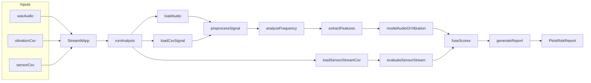

# VibraSense 工程定位与发展蓝图

## 项目定位
`VibraSense` 当前最合适的定位是一个面向工业设备健康分析的多模态时序信号 MVP 原型，而不是成熟的工业诊断平台。

它更适合被描述为：

- 一个可快速验证算法闭环的 PoC / MVP 工程。
- 一个把音频、振动、传感器流接入同一分析链路的演示型系统。
- 一个用于验证“预处理 + 频谱分析 + 特征提取 + 异常评分 + 风险融合 + 报告导出”是否成立的工程原型。

对外可以这样介绍：

> VibraSense 是一个面向设备健康监测的多模态时序信号分析原型，支持音频、振动和传感器流输入，输出频谱、异常评分、风险等级和工程解释报告。  
> 它适用于算法 PoC、巡检原型验证和设备异常分析流程演示，而不是直接替代成熟的工业诊断平台。

## 当前已实现的功能

### 1. 输入接入
- 支持上传 `wav` 音频文件。
- 支持上传振动 `csv` 文件，并由用户在界面填写振动采样率。
- 支持上传多列数值传感器流 `csv`。

### 2. 信号预处理
- 音频 / 振动信号支持去趋势。
- 按模态进行带通或低通滤波。
- 支持归一化处理。
- 生成基础 meta 信息供后续分析使用。

### 3. 频谱与主频分析
- 支持 FFT 频谱计算。
- 可识别主峰频率与 top-k 峰值频率。
- 可输出谐波候选与峰值置信度。
- 页面可展示原始 / 滤波后波形与频谱图。

### 4. 特征提取
- 时域特征：`rms`、`peak`、`crest_factor`、`mean`、`std`、`kurtosis`、`skewness`、`zcr`。
- 频域特征：谱能量、谱质心、谱带宽、低 / 中 / 高频能量比。
- 特征层已经能够消费统一频谱结果，具备后续训练 / 推理统一接口的基础。

### 5. 单模态异常检测
- 音频与振动都支持规则分打分。
- 音频与振动都支持窗口化特征矩阵构建。
- 支持基于 `IsolationForest` 的无监督异常分。
- 输出统一的 `score`、`label`、`confidence`、`evidence`、`rule_score`、`unsup_score`。

### 6. 传感器流分析
- 多列数值传感器流可做列级离群与漂移检测。
- 能生成模态级异常分、证据与贡献项。
- 已接入统一风险融合链路。

### 7. 多模态风险融合
- 支持 `audio` / `vibration` / `sensor` 三类模态权重融合。
- 支持使用 `confidence` 对模态权重进行修正。
- 输出 `0-100` 风险评分和 `Low / Medium / High` 风险等级。

### 8. 工程解释与导出
- 可生成 Markdown 报告。
- 可生成标准 JSON 报告摘要。
- 页面已支持直接下载 Markdown 与 JSON。

## 当前边界与能力上限
- 还不是基于真实工业基线数据稳定校准过的诊断系统。
- 无监督模型在当前主流程里仍以“当前样本窗口拟合”为主，尚未形成真正的离线训练 / 在线推理体系。
- 传感器流与音频 / 振动在分析路径上还不是同一类特征空间，只是在摘要层完成融合。
- 报告中的工程解释目前主要是规则化说明，还没有形成设备类型感知的深度诊断能力。
- 当前更偏向“批处理上传分析”，还没有实时流处理和告警系统。

## 工程原型图
当前工程最合理的原型结构如下：

这个原型图说明当前工程已经具备：

- 统一入口
- 分模态处理
- 统一融合
- 统一输出

这正是一个典型 MVP 原型应该具备的结构。

## 路线图

### 第一阶段：MVP 稳定化
目标：把现在的工程从“能演示”提升到“能稳定验证”。

主要任务：

- 补充测试样例与回归测试。
- 规范 CSV 输入格式，避免首列时间戳误判为振动信号。
- 固化关键阈值与配置项。
- 补齐异常输入、短信号、空文件等边界处理。
- 统一 README 中的输入说明、运行方式和样例使用说明。

交付结果：

- 可以稳定跑通多组示例数据。
- 音频 / 振动 / 传感器三条链路都有最小验证样本。
- 页面输出、报告输出、底层数值三者一致。

### 第二阶段：模型产品化
目标：把当前临时推理逻辑推进为可复现的模型系统。

主要任务：

- 引入基线数据与离线训练流程。
- 将 `model_artifact` 真正接入主流程。
- 保存 `scaler`、模型参数、特征顺序与版本信息。
- 让音频与振动支持离线训练、在线推理分离。
- 对融合权重、规则阈值、频带定义做配置化管理。

交付结果：

- `models/` 目录开始承载真正的模型产物。
- 相同数据多次运行结果更可重复。
- 可以基于真实样本对 AUC、误报率、漏报率做评估。

### 第三阶段：场景扩展与工程化部署
目标：把 MVP 演进为可接入业务场景的轻量平台。

主要任务：

- 增加 API 层或批处理入口，不只依赖 Streamlit 页面。
- 引入实时流或近实时数据处理能力。
- 对接告警、日志、模型版本管理。
- 扩展到更多设备类型、更多模态和更精细的报告解释。
- 支持长期数据管理、趋势分析和基线漂移监控。

交付结果：

- 从“单次上传分析工具”演进为“设备健康分析服务”。
- 可以服务实际巡检、实验室验证和轻量部署场景。

## 后续发展方向

### 方向 1：先做成强 PoC
适合当前阶段。

重点是：

- 增加高质量测试样本。
- 把音频和振动链路调到结果直观、可解释。
- 让报告更像一个工程工具，而不是简单分数展示。

### 方向 2：做成标准化分析工具
适合下一步毕业设计、项目答辩或技术展示。

重点是：

- 把训练、推理、评估分开。
- 增加样本管理、模型管理、配置管理。
- 增加一套最小评估指标体系。

### 方向 3：做成行业轻应用
适合后续继续深入。

重点是：

- 结合具体设备类型，比如风机、泵、轴承、电机。
- 为每类设备建立更强的特征与解释逻辑。
- 增加真实业务中的时序对齐、告警阈值、工单联动。

## 当前最适合的判断
对现在这个工程，建议定位是：

- 短期：工业设备健康分析 MVP / 多模态时序信号分析原型。
- 中期：可复现、可评估、可扩展的设备异常分析工具。
- 长期：面向具体设备场景的轻量智能诊断平台。

## 现在最值得优先推进的事项
- 先补样本与测试，建立可信的验证集。
- 再做训练 / 推理分离，解决当前分数稳定性问题。
- 最后再扩展实时处理、模型管理和业务接入。

这样做可以保证工程始终沿着“先可信、再可用、后可扩展”的路线发展。
